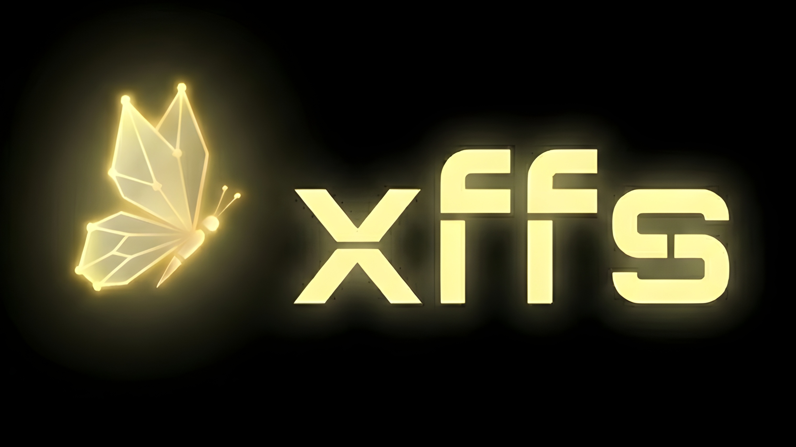

# XFFS — 西莱宗-复芯文件系统
## Xīláizōng Fùxīn Wénjiàn Xìtǒng

<p align="center">
  
</p>

**XFFS (Xilaizong-Fuxin File System)** is a teaching-oriented user-space filesystem written in C++17.
This project focuses on demonstrating core filesystem concepts such as block management, inode structures, and directory handling using a virtual disk.

---

## Project Goals

* User-space virtual disk filesystem
* Clear educational design
* Cross-platform (Windows & Linux)
* Bitmap block allocation
* Inode-based file management
* Extensible for advanced features

---

## Current Features

* Superblock layout and persistent metadata
* Block bitmap for allocation tracking
* Metadata block reservation system
* Virtual disk formatting tool (`mkxffs`)
* Block allocator and deallocator (`alloc_block` / `free_block`)
* Inode-based I/O (`read_inode` / `write_inode`) with XOR-sum integrity checks
* Root inode initialization during filesystem formatting
* Directory entry management (`dir_init`, `dir_add`, `dir_lookup`)
* Absolute path resolution (recursive traversal from root `/`)
* Hierarchical subdirectory support (`dir_create`)
* Interactive Command Line Interface (CLI) Shell (`xffs_shell`)

---

## System Requirements

### Windows

* Visual Studio 2019+ (with C++ workload)
* CMake ≥ 3.16
* PowerShell

### Linux

* GCC or Clang with C++17 support
* CMake ≥ 3.16
* make or ninja

---

## Build Instructions

From the project root:

```bash
cmake -S . -B build
cmake --build build
```

### Expected output

**Windows**

```
build/Debug/mkxffs.exe
```

**Linux**

```
build/mkxffs
```

---

## Create Virtual Disk Image

### Windows (PowerShell)

```powershell
fsutil file createnew xffs.img 67108864
```

### Linux

```bash
truncate -s 64M xffs.img
```

---

## Format the Filesystem

### Windows

```powershell
.\build\Debug\mkxffs.exe .\xffs.img
```

### Linux

```bash
./build/mkxffs ./xffs.img
```

### Expected output

```
[xffs] reserved blocks: 0-65
[xffs] data blocks start at: 66
xffs formatted successfully
```

---

## Interactive Shell

The XFFS Shell provides a REPL interface for managing files and directories on an existing virtual disk image.

### Initiation

#### Windows (PowerShell)
```powershell
.\build\Debug\xffs_shell.exe .\xffs.img
```

#### Linux
```bash
./build/xffs_shell ./xffs.img
```

### Supported Commands
| Command | Description |
| :--- | :--- |
| `ls [-la] <path>` | List directory contents (use `-la` for hidden files/perms) |
| `mkdir <path>` | Create a new directory |
| `touch <path>` | Create an empty file |
| `write <path> "text"`| Write text data to a file |
| `cat <path>` | Read file contents to stdout |
| `rm [-r] <path>` | Remove file or directory (use `-r` for recursive) |
| `stat <path>` | Display detailed inode/checksum information |
| `help` / `exit` | Show help or quit the shell |

---

## Scripting and Automation

XFFS supports non-interactive execution by piping command lists into the shell, which is useful for testing and automated deployment.

### Windows (PowerShell)
To avoid Encoding/BOM issues, use a text file:
```powershell
# Create a command list
Set-Content test_script.txt "mkdir /data`ntouch /data/log.txt`nexit"
# Pipe it
Get-Content test_script.txt | .\build\Debug\xffs_shell.exe .\xffs.img
```

### Linux
```bash
echo -e "mkdir /data\ntouch /data/log.txt\nexit" | ./build/xffs_shell ./xffs.img
```

---

## Verify Bitmap Integrity (Debug)

### Windows

```powershell
(Get-Content xffs.img -Encoding Byte -TotalCount (4096 + 64)) |
Select-Object -Skip 4096 |
Format-Hex
```

### Linux

```bash
hexdump -C xffs.img | head -n 40
```

You should see non-zero bytes at the start of block 1 after formatting.

---

## Project Directory Structure

```
xffs/
├─ include/xffs/   # on-disk structures and interfaces
├─ src/            # implementation
├─ tools/          # future utilities
├─ tests/          # test programs
├─ docs/           # design notes
└─ assets/         # logo and media
```

---

## Development Roadmap

### Phase 1 (current)

* [x] Disk abstraction
* [x] Superblock
* [x] Bitmap initialization

### Phase 3: File Operations & Path Resolution
* [x] Inode allocation/deallocation logic
* [x] File lifecycle: create, read, write, delete
* [x] Path resolution (absolute paths)

### Phase 4: Integrity & Shell
* [x] Inode XOR Checksums
* [x] Interactive REPL Shell (`xffs_shell`)
* [x] Recursive directory deletion (`rm -r`)

### Phase 5 (Future)
* [ ] **Indirect Blocks**: Support files larger than 48 KB.
* [ ] **WinFsp Integration**: Mount XFFS as a real drive on Windows!
* [ ] **Multiblock Directories**: Support directories with more than 64 entries.

---

## License

MIT License (recommended for academic projects).

---

## Authors and Credits

**XFFS — Xilaizong-Fuxin File System**

Developed as a filesystem learning project.

---

Developed with a focus on low-level systems education and architectural clarity.
